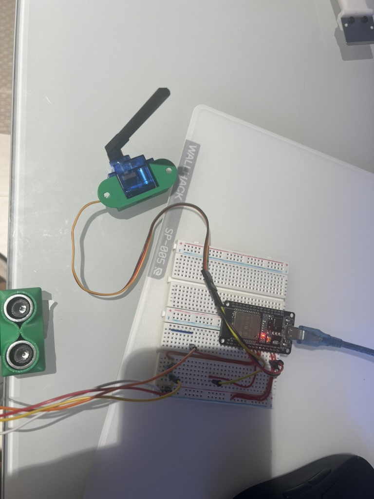
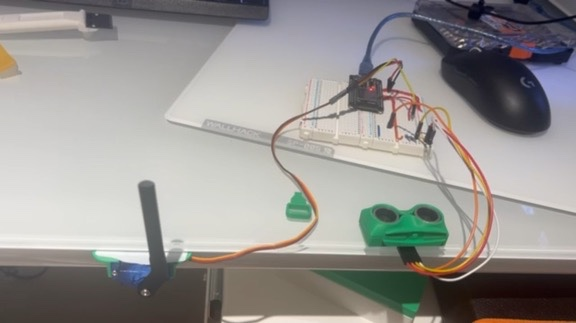

# Automatic Bin Opener (ESP32)

**Status: Complete and working.**

Wave a hand near an ultrasonic sensor mounted on a bin, and the lid opens on a servo, holds for 10 seconds (resetting the timer if you wave again while it's open), then closes — deliberately slowly, not a snap.

Rebuilt directly on the wiring from the [ultrasonic radar project](../ultrasonic-radar/), reusing the same HC-SR04 + servo pins — no joystick or mode button this time, just the sensor and the lid.

## Demo

*Servo mounted on its 3D-printed horn bracket, HC-SR04 wired in*

*Mounted at a bin-edge position, hanging off the desk to simulate the real mount*

> **Video demo:** uploaded separately via GitHub's Issues tab (New issue → drag the video into the comment box → copy the generated `user-attachments` link → paste it here on its own line).

## What it does

- Continuous distance monitoring; requires 3 consecutive **confirmed** close readings before triggering — not just 3 readings under the threshold, see the debugging section below for why that distinction matters.
- Opens the lid via a non-blocking, stepped servo sweep rather than an instant `servo.write()` jump — a slow, visible motion gives more reaction time if fingers are near the lid when it moves.
- 10-second open timer, implemented with `millis()` so the sensor keeps monitoring (and can extend the timer on a re-swipe) the whole time the lid is open.
- Closing uses the same gradual stepped motion as opening.

## Hardware

| Component | Notes |
|---|---|
| ESP32 dev board | |
| HC-SR04 ultrasonic sensor | |
| SG90 servo | Mounted via a 3D-printed horn bracket (see the radar project's README for the print credit — same mount reused here) |
| 2 resistors (1kΩ + 2kΩ) | Voltage divider for the Echo line |

### Wiring

| Signal | GPIO |
|---|---|
| HC-SR04 Trig | 26 |
| HC-SR04 Echo | 14 (through the voltage divider) |
| Servo signal | 27 |

Power from VIN, all grounds commoned. No LED, no joystick, no mode button in this version — deliberately stripped down to just what the bin actually needs.

## Files

- [`bin_opener.ino`](./bin_opener.ino) — full firmware

## What actually went wrong, and how it got fixed

This rebuild surfaced two real bugs that the original version never hit, both worth understanding rather than just copying the fix.

**The state machine never triggered, even though the sensor was clearly reading correctly.** Adding a live diagnostic print (raw distance every loop) showed something specific: readings alternated cleanly between a real number and a timeout sentinel — e.g. `2, 999, 2, 999, 2...` — even with a hand held perfectly still in front of the sensor. The `999` is the HC-SR04 timing out and returning no echo, and the original logic treated *any* reading that wasn't confirmed-close as "confirmed far," resetting the consecutive-close counter to zero. So every other loop iteration was silently cancelling the swipe detection, and the counter could never reach 3 in a row.

**Root cause of the alternating pattern itself:** the HC-SR04 needs roughly 60ms of recovery time between pings before it can reliably hear the next echo. The `CLOSED` state loop had no delay at all between measurements, hammering the sensor far faster than its recovery time — a textbook case of "the sensor spec has a minimum cycle time, and the code wasn't respecting it."

**The actual fix, in two parts:**
1. A timeout (`NO_ECHO`) is now treated as *inconclusive* — it neither counts as a close reading nor resets the counter. Only a genuine, confirmed far reading resets it.
2. Sensor reads are now rate-limited with a non-blocking `millis()` timer (`SENSOR_SETTLE_MS = 65`), giving the sensor time to recover between pings.

**Why a blanket `delay(65)` wasn't the right fix, even though it was tried first:** a plain `delay()` inside `loop()` would have also stalled `stepTowards()` during the `OPENING`/`CLOSING` states, reintroducing the exact "blocking delay breaks non-blocking motion" bug this whole portfolio has been actively avoiding since the very first fan project. The non-blocking timer approach keeps both the sensor's timing requirement and the servo's smooth stepping intact simultaneously.

**Simplification from the original design:** the earlier version of this project included a status LED. Rebuilt without one — the Serial output already gives clear state visibility, and the LED added a component with no functional benefit to the bin itself.

## Known limitation, stated honestly
The sensor faces outward to detect the *approach* swipe; it does not reliably see something directly under the lid rim at the moment of closing. The slow, visible closing motion is a real mitigation, but not a complete guarantee against a pinch.
