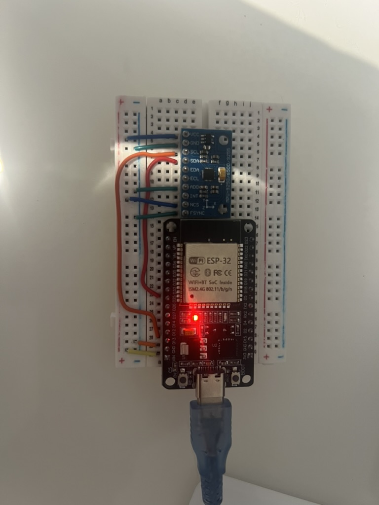
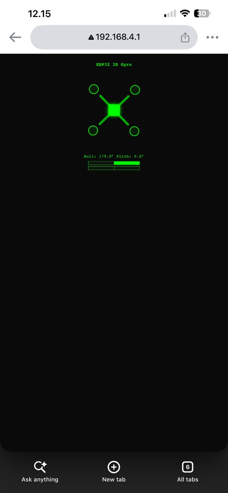

# 3D Gyro Visualizer (ESP32 + IMU)

**Status: Complete and working.**

An ESP32 reads an IMU over I2C, fuses the accelerometer and gyroscope into stable roll and pitch angles, and serves a live 3D drone visualization from its own WiFi network. Tilt the real board and a virtual quadcopter tilts with it on a phone or laptop screen.

## Demo

> **Add here:** a screenshot of the working version (roll ≈ 0° when flat) and/or the video. For video, upload through GitHub's Issues tab (New issue → drag the file into the comment box → copy the generated `user-attachments` link → paste it here on its own line).

## What it does

- Reads accelerometer and gyroscope data from an MPU6500-class IMU over I2C.
- Blends them with a complementary filter (98% gyro for short-term smoothness, 2% accelerometer to cancel long-term drift) into roll and pitch angles.
- Hosts its own WiFi access point and a small web server. The browser polls `/data` about every 60 ms and updates the page.
- The page draws a quadcopter hovering over a flat ground grid, seen from an angle. It tilts about its pitch and roll axes against the grid, so a tilt reads as a plate leaning against a level reference. The two front rotors and a nose marker are red so front and back can't be confused. A numeric readout and two centered bar gauges give a second, exact view of each axis.

## Hardware

| Component | Notes |
|---|---|
| ESP32 dev board | |
| GY-6500 IMU breakout (MPU6500-class, 10-pin) | Accelerometer + gyroscope, no magnetometer |

### Wiring

| IMU pin | Connects to |
|---|---|
| SDA | GPIO25 |
| SCL | GPIO13 |
| VCC | 3V3 or VIN, depending on your module's rated voltage |
| GND | GND |
| ADO | GND (sets I2C address to `0x68`) |
| FSYNC | GND |
| NCS | VCC (keeps the chip in I2C mode; left floating it can go silent on the bus) |
| EDA, ECL, INT | Unconnected (auxiliary magnetometer bus and interrupt, unused) |

The ESP32's I2C peripheral can be routed to almost any GPIO with `Wire.begin(sda, scl)`, so SDA and SCL don't have to sit on the default pins (21/22).

### Build photo

## Files

- [`gyro_3d.ino`](./gyro_3d.ino): full firmware, including the embedded web page

## Libraries

`Wire`, `WiFi` and `WebServer` are all built into the ESP32 Arduino core. Nothing to install.

## Usage

1. Flash `gyro_3d.ino`.
2. Open Serial Monitor at **115200 baud**. It prints the wake-write result (`0` means the IMU accepted it) and the access point address.
3. Join the WiFi network **`ESP32Gyro3D`** (password `gyro1234`).
4. Browse to the printed address, usually `192.168.4.1`.
5. Lay the board flat: roll and pitch should read near 0° and the drone should sit level on the grid.

While connected to the ESP32's access point, the device has no route to the wider internet. That is expected, not a fault.

## What actually went wrong, and how it got fixed

**The readout froze at Roll -45° / Pitch 35.3°, no matter how the board moved.** Those two numbers are not random, and that turned out to be the diagnostic clue. If every accelerometer register comes back as the same value (a failed read returning `0xFF`, which is -1 as a signed integer), the roll and pitch formulas evaluate to exactly -45° and 35.26°. A frozen, mathematically clean reading like that means the data was never real. The I2C scanner found the device, so the address was reachable. What failed was the actual multi-byte data read, which is a different transaction from the scanner's simple address probe. Fixes applied together: SDA/SCL confirmed on GPIO25/GPIO13 against the real wiring, a 50 ms settling delay after the sensor wake-up write, and a guard that discards any read returning fewer than the expected 14 bytes instead of feeding it to the filter. Worth stating plainly: these were applied as a bundle, so which of them was the deciding fix was not isolated.

**Roll read about 179° with the board lying flat.** This is a sign error, not noise, and the arithmetic explains it. The roll formula `atan2(accY, accZ)` gives about 0° when the Z-axis accelerometer reads +1 g. It gives about 180° when that axis reads -1 g, or when the code negates a +1 g reading. The firmware had carried over an `-accZ` negation from an earlier project where the IMU was mounted upside-down. Here the chip lies face-up, so the negation flipped the answer to 180°. Removing the minus sign fixed it. General lesson: axis sign corrections belong to a specific physical mount, so re-verify them every time the mount changes.

**The first version of the visualization hid that bug and didn't show tilt well.** The drone was an X-shaped outline, and an X looks identical when rotated 180°, so it appeared level while the readout said 179°. Worse, it was rotated with CSS `rotateZ`, which from a top-down view is yaw (spinning on the spot), not tilt. It was rebuilt with the drone hovering over a flat ground grid, rotating about its pitch and roll axes, with a red nose and front rotors to make orientation unambiguous.

## Design note: why no external 3D library

The ESP32 runs its own access point, so a connected phone has no internet route. A page that loads Three.js or any other CDN-hosted library would render its shell and then silently fail when the library request timed out. The 3D effect here is built from CSS 3D transforms (`perspective`, `preserve-3d`, `rotateX`, `rotateY`, `translateZ`) so the entire interface lives inside the firmware.

## Known limitations

- **Roll and pitch only, no yaw.** This IMU has no magnetometer, and integrating gyro yaw alone drifts steadily, so heading is deliberately not shown.
- **"Front" is arbitrary.** The sensor's axes don't know which edge of the board is the nose. Front is whichever direction the axes are taken to point, and the on-screen signs can be flipped in one line of the page's JavaScript if a tilt appears mirrored.
- **Filter blend not tuned further.** The 0.98/0.02 split is the standard starting point and works well here, but it was not optimized.
