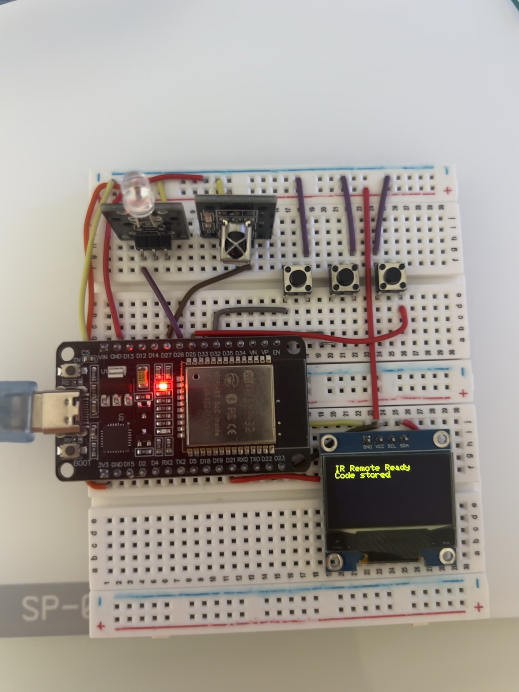
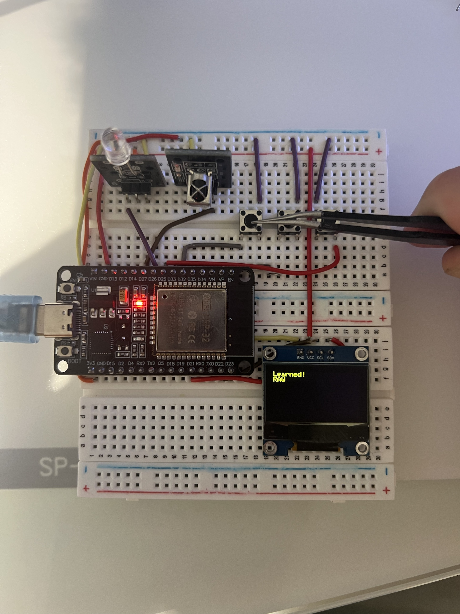
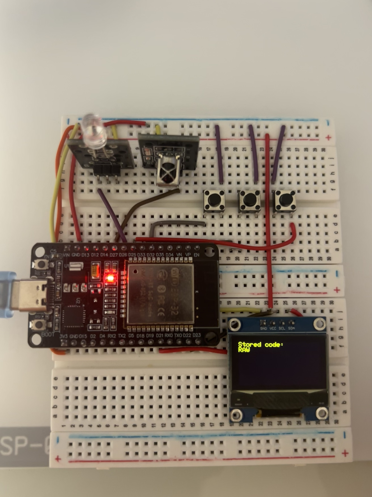
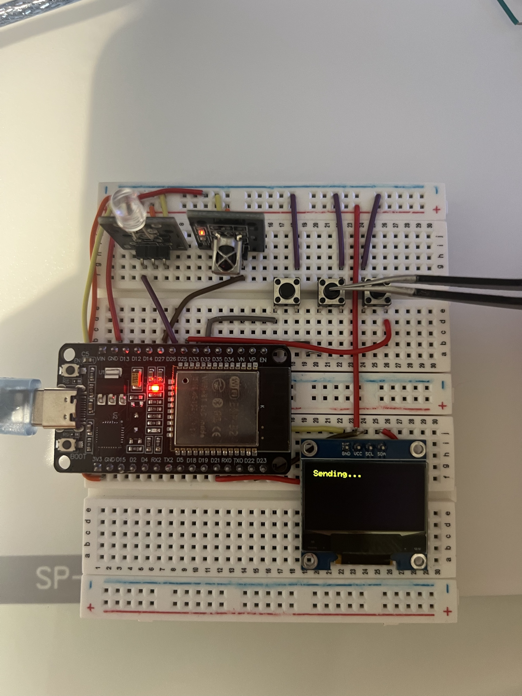
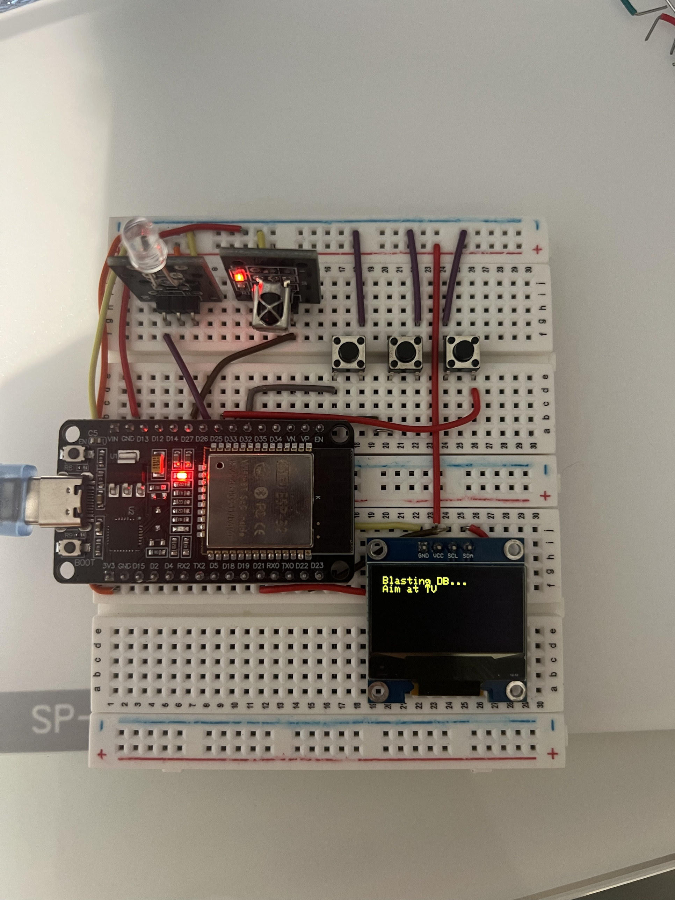
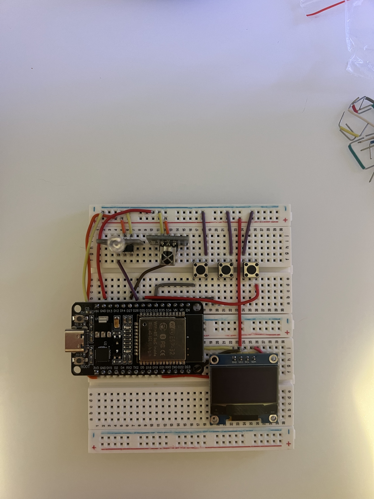
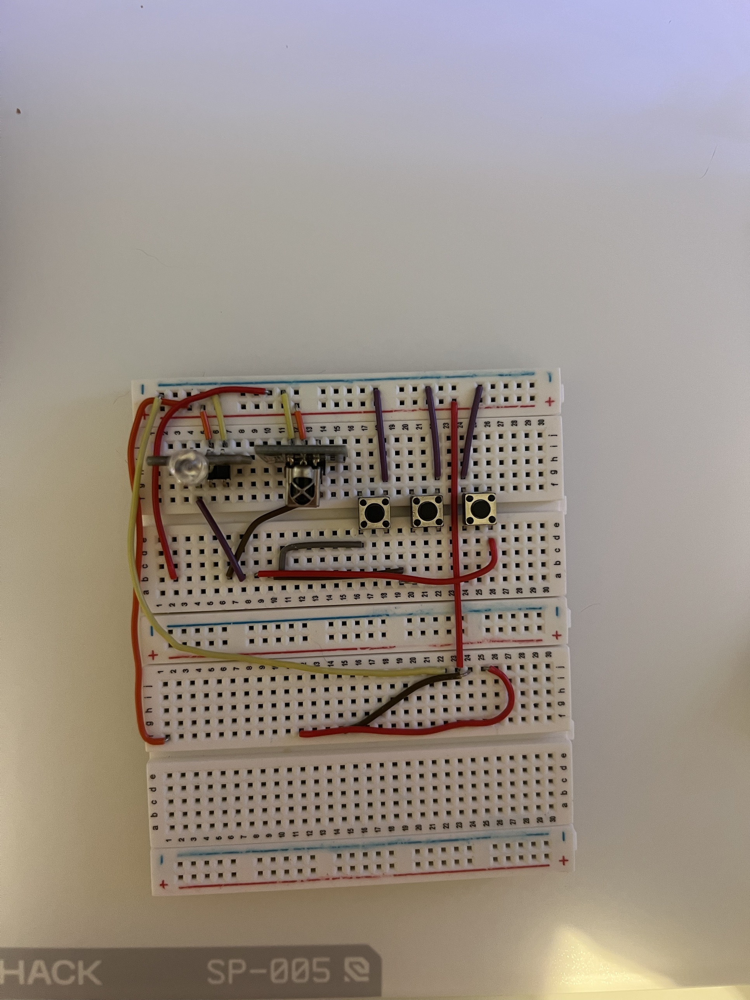

# Universal IR Remote (ESP32)

**Status: Complete and working.**

An ESP32-based IR remote that can learn a code from any real remote, replay it on demand, and — as a long-press option — blast an entire brand-code database (ported from the TV-B-Gone project) to try to power off an unknown TV.

## Demo

The sequence below is from an actual run, in order — boot, learning a real remote's code, checking what's stored, replaying it, and triggering a full database blast.

| | |
|---|---|
|  Boot state — a code was already stored from a previous session (flash-persisted) |  Learn mode capturing a new code from a real remote (unknown protocol, so it falls back to raw capture) |
|  Short Nav press — confirms what's currently stored |  Blast — replaying the stored code |
|  Nav long-press — full North American power-code database blast in progress | |

## What it does

- **Learn mode**: point any remote at the receiver, press a button; the device captures the code (auto-detecting known protocols like NEC, or falling back to a raw timing capture for anything nonstandard) and stores it in flash (survives power-off).
- **Blast mode**: replays whatever's currently stored.
- **Navigate button**: short press shows the currently stored code's protocol on the OLED. Long-press (1s+) fires a full TV-B-Gone-style blast of the entire North American power-code database — cycling through every known brand's off-code, on the theory that one of them will land.

## Hardware

| Component | Notes |
|---|---|
| ESP32-WROOM-32E DevKit | |
| IR receiver module (VS1838B-class) | 38kHz demodulator |
| IR emitter (KY-005 module) | Onboard resistor, no external driver needed for close-range use |
| 0.96" SSD1306 OLED | I2C |
| 3× tactile buttons | Learn / Blast / Navigate |

### Wiring

| Signal | GPIO |
|---|---|
| IR receiver output | 27 |
| IR emitter signal | 26 |
| OLED SDA | 21 |
| OLED SCL | 22 |
| Learn button | 32 |
| Blast button | 33 |
| Navigate button | 25 |

All buttons: one leg to GPIO, other leg to GND, `INPUT_PULLUP` in firmware — no external resistors.

### Build photos

## Libraries

- `IRremoteESP8266` — capture/replay and protocol decoding
- `Adafruit_SSD1306` + `Adafruit_GFX` — OLED driver
- `Preferences` — built into the ESP32 core, used for flash-persistent code storage

## Files

- [`tvremote.ino`](./tvremote.ino) — main firmware
- [`main.h`](./main.h) — small ESP32-compatible stub required by the TV-B-Gone code table (defines `freq_to_timerval()`, `NUM_ELEM()`, and the `IrCode` struct — the original AVR version of this file uses hardware timer registers that don't exist on ESP32)
- **`WORLD_IR_CODES.h`** — **not included in this repo.** Download it directly from [shirriff/Arduino-TV-B-Gone](https://github.com/shirriff/Arduino-TV-B-Gone/blob/master/WORLD_IR_CODES.h) (Raw → Save As) into this folder before compiling. It's a large third-party code table; pulling it from the original source avoids any risk of a corrupted transcription.

## What actually went wrong, and how it got fixed

This is the part of the project that mattered most, technically — not the finished firmware, but getting there.

**OLED stayed blank on first power-up.** Root cause turned out to be two independent bugs stacked together: the sketch had the wrong I2C address hardcoded (`0x3D` instead of the board's actual `0x3C`, found via an I2C scanner sketch), *and* `Serial.begin(9600)` didn't match the 115200 baud rate the Serial Monitor was set to — so even the library's own "allocation failed" error message was invisible. Fixed both; screen came alive.

**Buttons caused "chaos" — the OLED cycled rapidly through Learn/Blast/status messages with nothing touched.** This looked like a hardware short at first, but the actual bug was in the debounce logic: the code checked `if (digitalRead(pin) == LOW && cooldown expired)` — level-triggered with a cooldown, not edge-triggered. Any pin sitting at LOW (whether from noise, a floating connection, or a genuine wiring fault) re-passes that check every time the cooldown window closes, forever, with zero physical presses required. Rewrote it as a proper edge-triggered state machine (`Button` struct tracking raw reading vs. debounced stable state, firing only on a real LOW→HIGH→LOW transition) — this is the single most important lesson from the whole build, and it recurred in nearly every later project in this portfolio.
