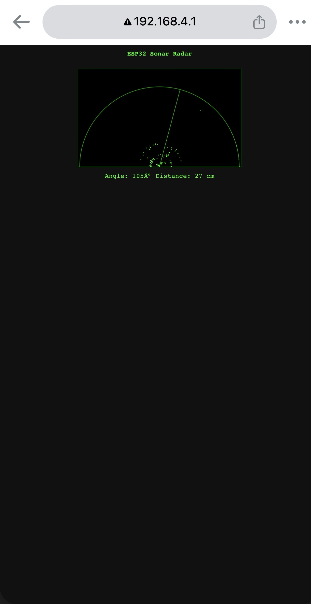
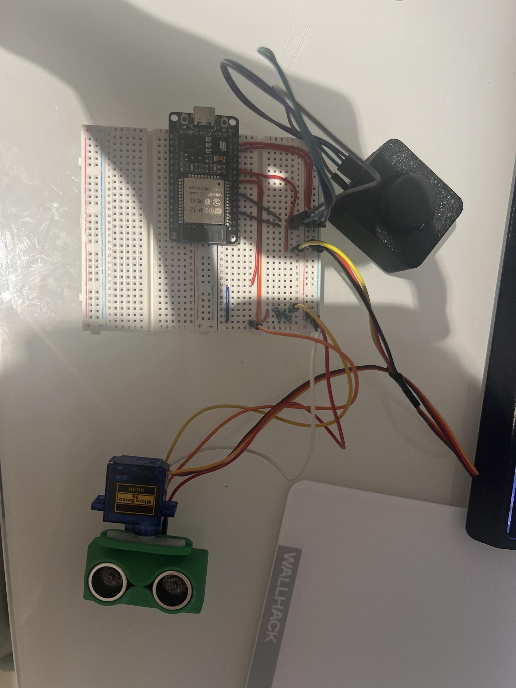
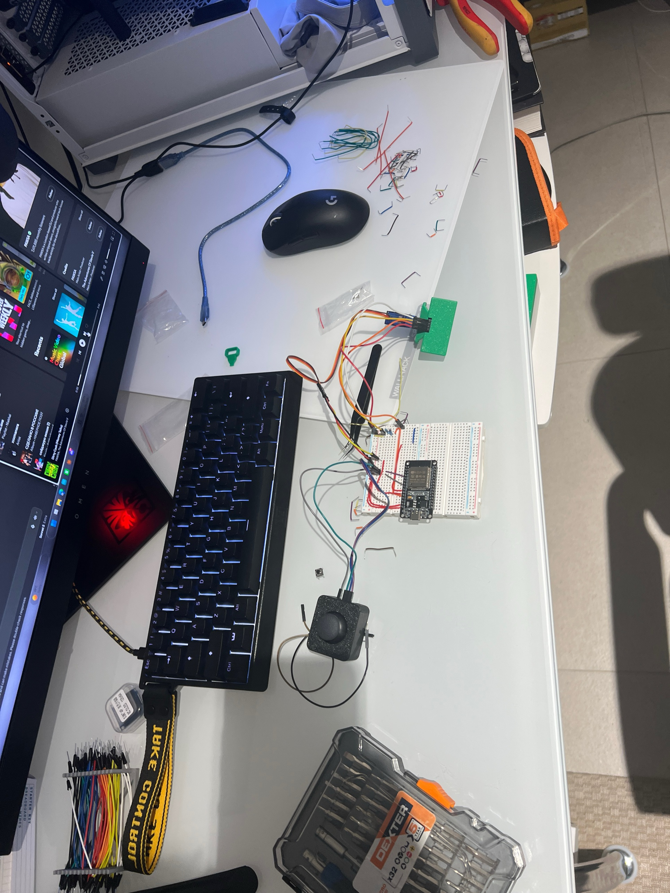

# Ultrasonic Radar Scanner with Live Web Map (ESP32)

**Status: Complete and working.**

A servo-mounted HC-SR04 ultrasonic sensor that sweeps like a radar dish, with a manual joystick-controlled aiming mode, and a live sonar map served from the ESP32 itself over WiFi — connect a phone or laptop to the board's own access point and watch the sweep and detected distances update in real time.

## Demo

The ESP32 hosts its own WiFi network and serves this page directly — the green arc is the sweep line, the dots are detected objects plotted in polar coordinates, and the readout below gives a live numeric angle and distance.

> **Video demo:** upload `media/demo-video.mov` via GitHub's Issues tab (New issue → drag the file into the comment box → copy the generated `user-attachments` URL → paste it here on its own line). Committing the `.mov` directly only produces a download link, not an inline player.

## What it does

- **Auto mode**: the servo sweeps 0°→180°→0° continuously, taking a distance reading at each 5° step.
- **Manual mode**: a joystick directly aims the servo instead of auto-sweeping. Toggled by clicking the joystick's built-in push button (SW).
- **Web interface**: live polar radar plot plus a numeric angle/distance readout, built with plain HTML canvas and vanilla JS — no external libraries (see the design note below for why that's deliberate, not a limitation).

## Hardware

| Component | Notes |
|---|---|
| ESP32 dev board | |
| HC-SR04 ultrasonic sensor | |
| SG90 servo | |
| KY-023 2-axis joystick module | X-axis for aiming, built-in SW button for mode toggle |
| 2 resistors (1kΩ + 2kΩ) | Voltage divider — protects the ESP32's 3.3V-only GPIO from the sensor's 5V Echo output |

### Wiring

| Signal | GPIO |
|---|---|
| HC-SR04 Trig | 26 |
| HC-SR04 Echo | 14 (through the voltage divider) |
| Servo signal | 27 |
| Joystick VRx | 34 |
| Joystick SW (mode toggle) | 33 |

Power from VIN, all grounds commoned. Joystick VRy left unconnected — only one axis is needed for a single-axis sweep.

**Voltage divider detail:** the HC-SR04's Echo pin outputs 5V, above the ESP32's 3.3V GPIO tolerance. The 1kΩ/2kΩ divider drops it to ~3.3V at the junction feeding GPIO14. Trig doesn't need this — the ESP32's 3.3V output is high enough for the sensor to read as logic HIGH.

### Build photos

## 3D printed parts

Neither model is included in this repository — both are under a Standard Digital File License that prohibits redistribution. Download them directly from the designers:

- **[HC-SR04 Case | Snap-Fit](https://makerworld.com/en/models/2291079-hc-sr04-case-snap-fit)** by [i-BoxIt](https://makerworld.com/en/@i.boxit) — the *RC Servo Mount* variant is the one used here, which mounts the sensor directly to the SG90's horn. Printed in PLA, snap-fit, no supports needed.
- **[Joystick Module Case](https://makerworld.com/en/models/2294262-joystick-module-case)** by [Tavo](https://makerworld.com/en/@Tavo) — protective case for the KY-023 joystick module. Uses 4× M3 screws.

## Files

- [`radar_web.ino`](./radar_web.ino) — full firmware: sweep/manual logic, mode button handling, and the embedded web server with its HTML/JS page

## Libraries

- `ESP32Servo` — servo control
- `WiFi` + `WebServer` — both built into the ESP32 Arduino core, no separate install

## Usage

1. Flash `radar_web.ino`.
2. Open Serial Monitor at **115200 baud** — it prints the access point name and IP on boot.
3. Join the WiFi network **`ESP32Radar`** (password `radar1234`).
4. Browse to the printed IP — usually `192.168.4.1`.
5. Click the joystick straight down to toggle between auto-sweep and manual aiming.

While connected to the ESP32's access point, the device has no route to the wider internet — expected, not a fault.

## What actually went wrong, and how it got fixed

**The `ledcSetup()`/`ledcAttachPin()` PWM API didn't compile.** The installed ESP32 Arduino core is 3.x, which replaced that pair with `ledcAttach()` and pin-addressed `ledcWrite()`. Every ESP32 PWM sketch in this portfolio uses the corrected API for this reason.

**The mode button did nothing — Serial showed no state change on press.** Tracing the debounce logic by hand found the bug: `lastButtonState` was being overwritten *unconditionally* at the end of the function, one loop iteration before the debounce window had elapsed. By the time the code checked for a LOW→HIGH transition, the "previous" state had already been clobbered to match the current one, so the transition could never be detected. Fixed by splitting into two variables — a raw reading used only to reset the debounce timer, and a separately-tracked debounced state that only updates once the timer has genuinely expired.

**Degree symbol rendered as `°` in the browser.** Classic UTF-8/Latin-1 mismatch — the page didn't declare its character encoding, so the browser guessed wrong and misinterpreted the multi-byte `°` character. Fixed by adding `<meta charset="UTF-8">` to the page head. Worth recognizing on sight: `Â` appearing before an otherwise-correct special character is almost always this exact problem, not a typo in the source.

**GPIO pin layout had to be reshuffled once real hardware was in hand.** The original pin choices split across the dev board's two physical header rows, and the board only exposes VIN (no 3V3) on the row being used. Reassigned to keep the whole build on one header row while avoiding GPIO12 (a boot-strapping pin) and the input-only ADC-capable pins.

**Simplification during the rebuild:** the original design used a separate tactile button for the mode toggle. Since the KY-023 joystick already has a built-in push switch on its SW pin — electrically identical to a standalone momentary button — the separate button was dropped entirely. One less component, one less set of connections, zero firmware changes required.

## Design note: why no external JS library

The ESP32 runs in access-point mode so the radar works without any existing network — but that also means a connected device has no route to the internet. A visualization built with a CDN-hosted graphics library (Three.js, Chart.js) would load the page shell fine and then silently fail when the library request timed out, with no obvious cause. Building the plot from plain `<canvas>` and vanilla JS avoids that trap entirely and keeps the whole interface self-contained in the firmware.
